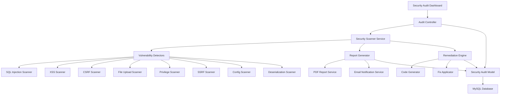

# Design Document

## Overview

The Security Audit System for AMIS Five is a comprehensive security scanning and remediation platform designed to identify, assess, and mitigate CodeIgniter 4 security vulnerabilities. The system will integrate seamlessly with the existing AMIS Five architecture, providing automated vulnerability scanning, detailed reporting, and guided remediation tools. The design follows the established MVC pattern and leverages CodeIgniter 4's built-in security features while extending them with custom security analysis capabilities.

## Architecture

### High-Level Architecture



### System Integration

The security audit system integrates with the existing AMIS Five application through:

- **Controller Layer**: New `SecurityAuditController` extending `BaseController`
- **Model Layer**: `SecurityAuditModel` for storing scan results and configurations
- **View Layer**: Security dashboard views using the existing `system_template.php`
- **Service Layer**: Custom security scanning services
- **Database Layer**: New tables for audit logs, vulnerability tracking, and remediation history

## Components and Interfaces

### 1. Security Audit Controller

**Location**: `app/Controllers/Admin/SecurityAuditController.php`

**Responsibilities**:
- Handle security audit dashboard requests
- Initiate security scans
- Display vulnerability reports
- Manage remediation workflows
- Export audit reports

**Key Methods**:
```php
public function index()                    // Dashboard view
public function startScan()               // Initiate security scan
public function viewReport($scanId)       // Display scan results
public function exportReport($scanId)     // Export PDF report
public function applyFix($vulnerabilityId) // Apply automated fixes
public function scheduleScans()           // Configure scheduled scans
```

### 2. Security Scanner Service

**Location**: `app/Libraries/SecurityScannerService.php`

**Responsibilities**:
- Orchestrate all security scans
- Coordinate individual vulnerability detectors
- Aggregate scan results
- Generate comprehensive security reports

**Interface**:
```php
interface SecurityScannerInterface
{
    public function runFullScan(): array;
    public function runTargetedScan(string $scanType): array;
    public function getScanProgress(): array;
    public function cancelScan(): bool;
}
```

### 3. Vulnerability Detector Components

#### SQL Injection Scanner
**Location**: `app/Libraries/Scanners/SqlInjectionScanner.php`

**Functionality**:
- Scan all PHP files for raw SQL queries
- Identify unescaped user input in database operations
- Check for proper use of Query Builder
- Validate prepared statement usage
- Verify db_debug configuration

#### XSS Scanner
**Location**: `app/Libraries/Scanners/XssScanner.php`

**Functionality**:
- Analyze view files for unescaped output
- Check for proper use of `esc()` function
- Identify JavaScript injection points
- Validate XSS filter configuration
- Test form input sanitization

#### CSRF Scanner
**Location**: `app/Libraries/Scanners/CsrfScanner.php`

**Functionality**:
- Scan forms for CSRF token presence
- Verify CSRF configuration in Security.php
- Check POST/PUT/DELETE route protection
- Validate token generation and verification

#### File Upload Scanner
**Location**: `app/Libraries/Scanners/FileUploadScanner.php`

**Functionality**:
- Analyze upload functionality for security gaps
- Check file type restrictions
- Verify directory permissions
- Validate MIME type checking
- Assess file storage locations

#### Privilege Escalation Scanner
**Location**: `app/Libraries/Scanners/PrivilegeScanner.php`

**Functionality**:
- Audit user role management
- Check authentication mechanisms
- Identify hardcoded credentials
- Verify session security
- Assess authorization controls

#### SSRF Scanner
**Location**: `app/Libraries/Scanners/SsrfScanner.php`

**Functionality**:
- Identify external HTTP request functions
- Check URL validation mechanisms
- Verify domain allowlists
- Assess API endpoint security

#### Configuration Scanner
**Location**: `app/Libraries/Scanners/ConfigScanner.php`

**Functionality**:
- Check file permissions
- Verify .env protection
- Assess production configuration
- Validate error reporting settings
- Check directory security

#### Deserialization Scanner
**Location**: `app/Libraries/Scanners/DeserializationScanner.php`

**Functionality**:
- Identify serialization/deserialization usage
- Check for unsafe deserialization
- Validate data source trust
- Recommend safe alternatives

### 4. Report Generator Service

**Location**: `app/Libraries/ReportGeneratorService.php`

**Responsibilities**:
- Generate comprehensive security reports
- Create executive summaries
- Produce technical vulnerability details
- Generate remediation recommendations
- Export reports in multiple formats

**Features**:
- PDF report generation using TCPDF
- HTML dashboard reports
- CSV export for vulnerability tracking
- Email report distribution
- Historical trend analysis

### 5. Remediation Engine

**Location**: `app/Libraries/RemediationEngine.php`

**Responsibilities**:
- Provide automated fix suggestions
- Generate secure code examples
- Apply batch remediation
- Track remediation progress
- Validate fix effectiveness

**Capabilities**:
- SQL injection fix generation (Query Builder conversion)
- XSS protection code insertion
- CSRF token implementation
- File upload security enhancement
- Configuration security improvements

## Data Models

### Security Audit Model

**Location**: `app/Models/SecurityAuditModel.php`

**Database Tables**:

#### security_scans
```sql
CREATE TABLE security_scans (
    id INT PRIMARY KEY AUTO_INCREMENT,
    scan_type ENUM('full', 'targeted') NOT NULL,
    status ENUM('pending', 'running', 'completed', 'failed') NOT NULL,
    started_at TIMESTAMP NULL,
    completed_at TIMESTAMP NULL,
    total_files_scanned INT DEFAULT 0,
    vulnerabilities_found INT DEFAULT 0,
    critical_count INT DEFAULT 0,
    high_count INT DEFAULT 0,
    medium_count INT DEFAULT 0,
    low_count INT DEFAULT 0,
    scan_config JSON,
    created_by INT,
    created_at TIMESTAMP DEFAULT CURRENT_TIMESTAMP,
    updated_at TIMESTAMP DEFAULT CURRENT_TIMESTAMP ON UPDATE CURRENT_TIMESTAMP,
    FOREIGN KEY (created_by) REFERENCES users(id)
);
```

#### vulnerabilities
```sql
CREATE TABLE vulnerabilities (
    id INT PRIMARY KEY AUTO_INCREMENT,
    scan_id INT NOT NULL,
    vulnerability_type ENUM('sql_injection', 'xss', 'csrf', 'file_upload', 'privilege_escalation', 'ssrf', 'config', 'deserialization') NOT NULL,
    severity ENUM('critical', 'high', 'medium', 'low') NOT NULL,
    file_path VARCHAR(500) NOT NULL,
    line_number INT,
    code_snippet TEXT,
    description TEXT NOT NULL,
    recommendation TEXT NOT NULL,
    status ENUM('open', 'fixed', 'false_positive', 'accepted_risk') DEFAULT 'open',
    remediation_applied BOOLEAN DEFAULT FALSE,
    remediation_date TIMESTAMP NULL,
    created_at TIMESTAMP DEFAULT CURRENT_TIMESTAMP,
    updated_at TIMESTAMP DEFAULT CURRENT_TIMESTAMP ON UPDATE CURRENT_TIMESTAMP,
    FOREIGN KEY (scan_id) REFERENCES security_scans(id) ON DELETE CASCADE
);
```

#### remediation_history
```sql
CREATE TABLE remediation_history (
    id INT PRIMARY KEY AUTO_INCREMENT,
    vulnerability_id INT NOT NULL,
    action_type ENUM('auto_fix', 'manual_fix', 'status_change') NOT NULL,
    old_code TEXT,
    new_code TEXT,
    applied_by INT,
    applied_at TIMESTAMP DEFAULT CURRENT_TIMESTAMP,
    success BOOLEAN DEFAULT TRUE,
    error_message TEXT,
    FOREIGN KEY (vulnerability_id) REFERENCES vulnerabilities(id) ON DELETE CASCADE,
    FOREIGN KEY (applied_by) REFERENCES users(id)
);
```

#### scan_configurations
```sql
CREATE TABLE scan_configurations (
    id INT PRIMARY KEY AUTO_INCREMENT,
    name VARCHAR(100) NOT NULL,
    scan_types JSON NOT NULL,
    file_patterns JSON,
    exclude_patterns JSON,
    schedule_enabled BOOLEAN DEFAULT FALSE,
    schedule_cron VARCHAR(100),
    email_notifications BOOLEAN DEFAULT TRUE,
    notification_recipients JSON,
    created_by INT,
    created_at TIMESTAMP DEFAULT CURRENT_TIMESTAMP,
    updated_at TIMESTAMP DEFAULT CURRENT_TIMESTAMP ON UPDATE CURRENT_TIMESTAMP,
    FOREIGN KEY (created_by) REFERENCES users(id)
);
```

## Error Handling

### Exception Hierarchy

```php
// Base security audit exception
class SecurityAuditException extends Exception {}

// Specific exceptions
class ScannerException extends SecurityAuditException {}
class ReportGenerationException extends SecurityAuditException {}
class RemediationException extends SecurityAuditException {}
class ConfigurationException extends SecurityAuditException {}
```

### Error Handling Strategy

1. **Graceful Degradation**: If one scanner fails, others continue
2. **Detailed Logging**: All errors logged with context
3. **User-Friendly Messages**: Technical errors translated for users
4. **Recovery Mechanisms**: Automatic retry for transient failures
5. **Notification System**: Critical errors trigger immediate alerts

### Logging Implementation

```php
// Custom security audit logger
class SecurityAuditLogger
{
    public function logScanStart(int $scanId): void;
    public function logVulnerabilityFound(array $vulnerability): void;
    public function logRemediationApplied(int $vulnerabilityId): void;
    public function logError(string $component, Exception $e): void;
}
```

## Testing Strategy

### Unit Testing

**Test Coverage Areas**:
- Individual vulnerability scanners
- Report generation functions
- Remediation engine components
- Data model operations
- Configuration management

**Test Files Location**: `tests/unit/SecurityAudit/`

**Key Test Classes**:
```php
SqlInjectionScannerTest.php
XssScannerTest.php
CsrfScannerTest.php
FileUploadScannerTest.php
ReportGeneratorTest.php
RemediationEngineTest.php
```

### Integration Testing

**Test Scenarios**:
- Full security scan workflow
- Report generation and export
- Automated remediation application
- Email notification delivery
- Database transaction integrity

**Test Files Location**: `tests/integration/SecurityAudit/`

### Security Testing

**Validation Tests**:
- Scanner accuracy verification
- False positive/negative analysis
- Remediation effectiveness validation
- Performance impact assessment
- Access control verification

### Test Data Management

**Mock Vulnerable Code**: Create controlled vulnerable code samples for testing
**Test Database**: Separate test database with sample vulnerability data
**Automated Test Runs**: Integration with CI/CD pipeline for continuous testing

## Performance Considerations

### Scanning Optimization

1. **Incremental Scanning**: Only scan modified files
2. **Parallel Processing**: Multiple scanners run concurrently
3. **Memory Management**: Stream processing for large files
4. **Caching**: Cache scan results for unchanged files
5. **Background Processing**: Long scans run as background jobs

### Database Optimization

1. **Indexing Strategy**: Proper indexes on scan_id, file_path, vulnerability_type
2. **Data Retention**: Automatic cleanup of old scan data
3. **Query Optimization**: Efficient queries for report generation
4. **Connection Pooling**: Reuse database connections

### Resource Management

1. **Memory Limits**: Configurable memory limits for scans
2. **Time Limits**: Scan timeout mechanisms
3. **File System**: Efficient file reading and processing
4. **CPU Usage**: Throttling for resource-intensive operations

## Security Considerations

### Access Control

1. **Role-Based Access**: Only admin users can access security audit features
2. **Audit Logging**: All security audit actions logged
3. **Data Protection**: Sensitive vulnerability data encrypted
4. **Session Security**: Secure session management for audit interface

### Data Privacy

1. **Code Snippet Sanitization**: Remove sensitive data from stored code snippets
2. **Report Access Control**: Restrict report access to authorized users
3. **Export Security**: Secure PDF generation and distribution
4. **Data Retention**: Configurable data retention policies

### System Security

1. **Input Validation**: All user inputs validated and sanitized
2. **Output Encoding**: All output properly encoded
3. **CSRF Protection**: All forms protected with CSRF tokens
4. **SQL Injection Prevention**: All database queries use prepared statements